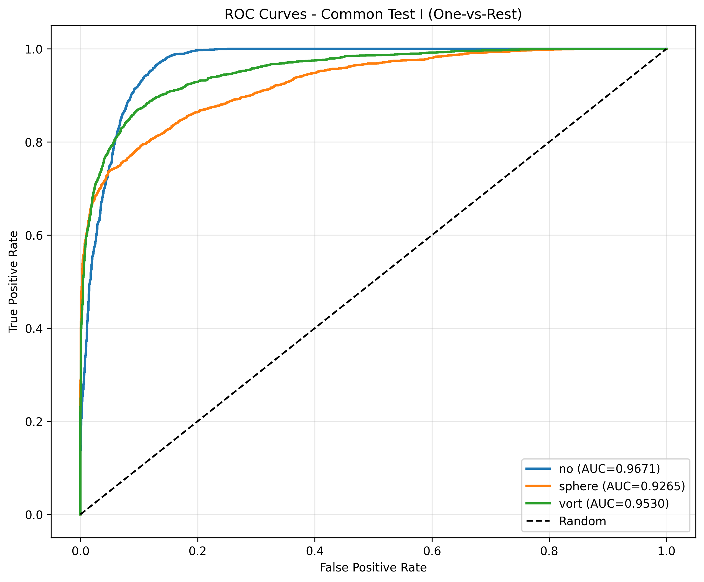
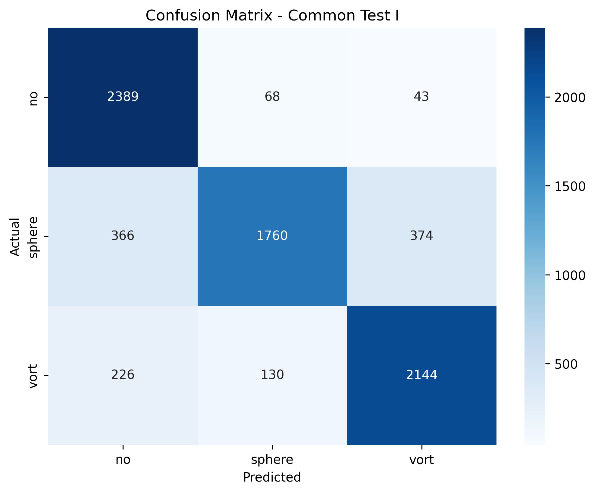

# ML4SCI GSoC 2026 — DeepLense: Gravitational Lens Finding

**GitHub:** github.com/ojayballer  
**Organization:** ML4SCI  
**Project of Interest:** Gravitational Lens Finding  

---

## Completed Tests

- **Common Test I** — Multi-Class Classification (see `task1/`)
- **Specific Test V** — Lens Finding and Data Pipelines (see `task2/`)

---

## Common Test I: Multi-Class Classification

### Task

Classify strong lensing images into three categories: no substructure, 
subhalo substructure, and vortex substructure.

---

### Strategy

The dataset comes pre-split into train and validation folders, perfectly 
balanced at 10,000 images per class (30,000 total), and already min-max 
normalized. Each image is a single-channel numpy array of shape (1, 150, 150).

**Model Choice: Transfer Learning with ResNet-18**

I started by training a custom CNN from scratch. Every attempt produced 
random-chance accuracy of around 33%, meaning the model was not learning 
anything at all. A randomly initialized CNN on this dataset size simply 
does not have enough signal to learn useful feature representations without 
a strong starting point.

Switching to a pretrained ResNet-18 with ImageNet weights fixed this 
immediately. The pretrained weights provide strong low-level feature 
detectors for edges, textures, and shapes that transfer surprisingly well 
to astronomical images. From there, the model only needs to learn the 
higher-level features specific to gravitational lens substructure.

Two modifications were made to the standard ResNet-18:

1. The first convolutional layer was changed to accept 1-channel grayscale 
input instead of the standard 3-channel RGB input.

2. The final fully connected layer was changed to output 3 class logits 
instead of the standard 1000 ImageNet classes.

**Data Augmentation**

Random horizontal flips, vertical flips, and 90 degree rotations were 
applied during training. These augmentations are physically motivated 
because gravitational lenses have no preferred orientation in the sky. 
The model should treat a rotated or flipped lens as the same object. 
No augmentation was applied to the validation set.

**Loss Function**

Since the dataset is perfectly balanced across all three classes, standard 
CrossEntropyLoss works well here with no need for class weighting or 
specialized loss functions.

---

### Results

| Metric | Score |
|--------|-------|
| Best Validation Accuracy | 0.8391 |
| Macro AUC | **0.9489** |
| no substructure AUC | 0.9671 |
| sphere substructure AUC | 0.9265 |
| vortex substructure AUC | 0.9530 |

Full metrics: [task1_metrics.json](task1/results/task1_metrics.json)

---

### ROC Curves (One-vs-Rest)



---

### Confusion Matrix



---

### Model Architecture
```
Input: (1, 150, 150) single channel grayscale
        |
ResNet-18 backbone pretrained on ImageNet
conv1 modified to accept 1-channel input
        |
512-dimensional feature vector
        |
Linear(512, 3) classifier
        |
Softmax giving class probabilities for no, sphere, vort
```

---

### Hyperparameters

| Parameter | Value |
|-----------|-------|
| Learning rate | 1e-4 |
| Weight decay | 1e-4 |
| Batch size | 64 |
| Epochs | 10 |
| Optimizer | AdamW |
| Scheduler | CosineAnnealingLR (T_max=5) |
| Loss | CrossEntropyLoss |

---

### Pre-trained Weights

[best_model.pth](task1/results/best_model.pth)

---

### Setup
```bash
pip install torch torchvision scikit-learn matplotlib seaborn numpy
```

Dataset structure expected:
```
task1/
└── dataset/dataset/
    ├── train/
    │   ├── no/
    │   ├── sphere/
    │   └── vort/
    └── val/
        ├── no/
        ├── sphere/
        └── vort/
```

Run: `task1/notebooks/task1.ipynb`

---

## Specific Test V: Lens Finding and Data Pipelines

### Task

Build a binary classifier that identifies gravitational lenses in 
observational survey data. Train on `train_lenses` and `train_nonlenses`, 
evaluate on `test_lenses` and `test_nonlenses`. The dataset has severe 
class imbalance where non-lenses vastly outnumber lenses.

---

### Strategy

The primary challenge in this task is the 100:1 class imbalance. When 
training with standard Binary Cross-Entropy loss on data this imbalanced, 
the model quickly learns to predict non-lens for almost everything because 
it gets rewarded for being right 99% of the time. The result is artificially 
high accuracy with near-zero recall on the lens class, which is the only 
class that actually matters.

My approach addresses this in two stages.

**Stage 1: Baseline with BCE Loss**

I trained an EfficientNet-B2 encoder paired with a 2-layer MLP classifier 
using standard Binary Cross-Entropy loss. The encoder extracts a 
256-dimensional feature vector from each image and the classifier outputs 
a lens probability. The data was split 90:10 into train and validation sets 
using sklearn's train_test_split with a fixed random seed for reproducibility. 
This stage establishes a performance baseline to compare against.

Note: EfficientNet-B2 was trained from scratch here (pretrained=False) 
because the simulated astronomical images are sufficiently different from 
natural images that ImageNet pretraining provides minimal benefit. The 
original DeepLense codebase also follows this approach.

**Stage 2: Focal Loss Fine-tuning**

I loaded the baseline weights and fine-tuned the model using Focal Loss 
with alpha=0.25 and gamma=2.0, introduced by Lin et al. (2017). Rather 
than treating every training example equally, Focal Loss down-weights 
easy, well-classified non-lens examples so they barely contribute to 
the gradient update. This forces the model to focus its learning capacity 
on the hard, rare lens candidates instead of continuing to memorize the 
easy majority class. The fine-tuning used a reduced learning rate of 5e-5 
to preserve the useful representations learned during baseline training.

**Why PR-AUC matters more than AUCROC here**

At 100:1 class imbalance, AUCROC can look strong even when the model is 
nearly useless on the minority class. This happens because the false 
positive rate denominator is so large that even a flood of false positives 
barely moves the curve. PR-AUC directly measures precision and recall on 
the minority class, which is what actually tells you whether the model is 
finding real lenses or just getting lucky on easy examples.

---

### Results

| Model | AUCROC | PR-AUC |
|-------|--------|--------|
| Baseline (BCE Loss) | 0.9104 | 0.5500 |
| Focal Loss Fine-tuned | **0.9154** | **0.5762** |
| Improvement | +0.0050 | **+0.0262** |

Full metrics: [baseline_metrics.json](task2/results/baseline(TestV)_metrics/baseline_metrics.json) 
and [focal_loss_metrics.json](task2/results/focal_loss_improvement/focal_loss_metrics.json)  
Comparison: [focal_loss_comparison.csv](task2/results/focal_loss_improvement/focal_loss_comparison.csv)

The +2.62% gain in PR-AUC confirms that Focal Loss successfully shifted 
the model's attention toward hard lens candidates rather than continuing 
to reward easy non-lens predictions.

---

### Pre-trained Weights

Encoder: [FocalLoss_Encoder_epoch1_auc0.9166.pth](task2/results/focal_loss_improvement/FocalLoss_Encoder_epoch1_auc0.9166.pth)

Classifier: [FocalLoss_Classifier_epoch1_auc0.9166.pth](task2/results/focal_loss_improvement/FocalLoss_Classifier_epoch1_auc0.9166.pth)

---

### ROC Curves

**Baseline — AUC: 0.9104**

_metrics/roc_curve_baseline.png)

**Focal Loss Fine-tuned — AUC: 0.9154**


---

### Training Curves


Training history: [focal_loss_training_curves.csv](task2/results/focal_loss_improvement/focal_loss_training_curves.csv)

---

### Model Architecture
```
Input: (1, 64, 64) derived from channel-wise averaging of 3-channel input
        |
EfficientNet-B2 backbone (timm, pretrained=False)
        |
AdaptiveAvgPool2d, Dropout, PReLU, Linear(1408, 256)
        |
256-dimensional feature vector
        |
Linear(256, 1) classifier
        |
Sigmoid giving lens probability
```

---

### Hyperparameters

| Parameter | Baseline | Focal Loss |
|-----------|----------|------------|
| Learning rate | 1e-4 | 5e-5 |
| Weight decay | 1e-5 | 1e-5 |
| Batch size | 64 | 64 |
| Epochs | 3 | 3 |
| Optimizer | AdamW | AdamW |
| Scheduler | Cosine with warmup | Cosine with warmup |
| Loss | BCEWithLogitsLoss | FocalLoss(α=0.25, γ=2.0) |

---

### Validation Split

90:10 split using train_test_split(test_size=0.10, random_state=42).

---

### Setup
```bash
pip install torch timm albumentations scikit-learn transformers \
            ipywidgets matplotlib pandas opencv-python e2cnn
```

Extract the dataset so the structure is:
```
task2/
└── lens-finding-test/
    ├── train_lenses/
    ├── train_nonlenses/
    ├── test_lenses/
    └── test_nonlenses/
```

Run notebooks in order:

1. `task2/notebooks/01_Baseline(TestV).ipynb`
2. `task2/notebooks/02_focal_loss.ipynb`

---

## References

Nath, M. et al. (2022). Gravitational Lens Detection via Domain Adaptation.  
GSoC 2022, ML4SCI. https://github.com/mrinath123/Deeplense_Gravitational_lensing

Lin, T. et al. (2017). Focal Loss for Dense Object Detection.  
Facebook AI Research. arXiv:1708.02002