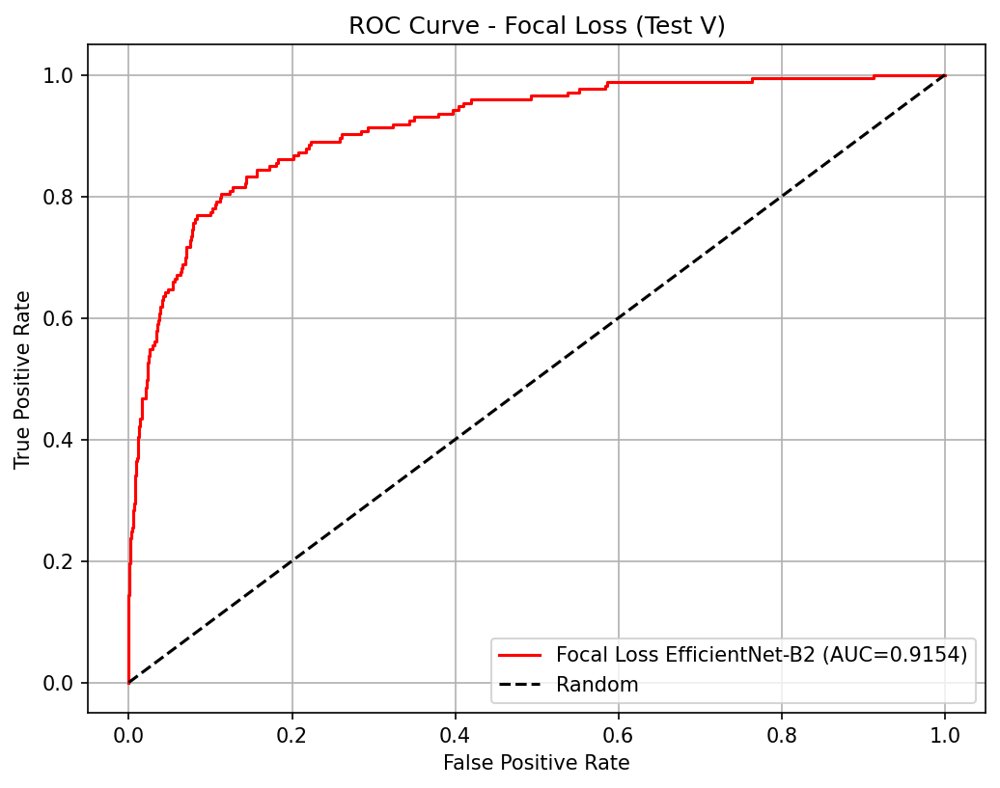
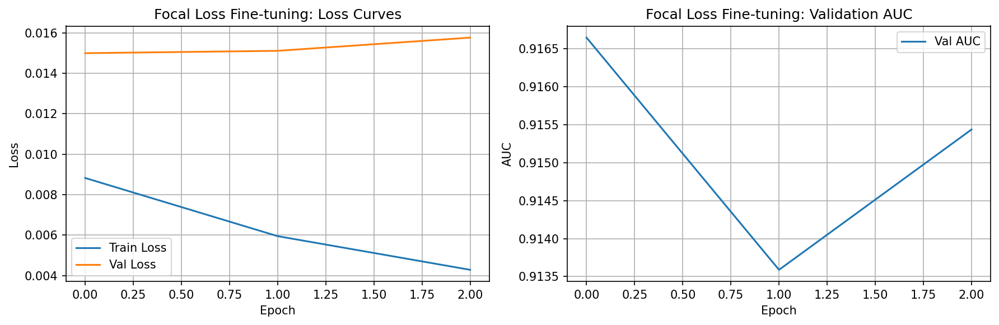

# ML4SCI GSoC 2026 — DeepLense: Gravitational Lens Finding

**GitHub:** github.com/ojayballer  
**Organization:** ML4SCI  
**Project of Interest:** Gravitational Lens Finding  

---

## Completed Tests

- **Common Test I** — Multi-Class Classification (see `task1/`)
- **Specific Test V** — Lens Finding & Data Pipelines (see `task2/`)

---

## Common Test I — Multi-Class Classification

*(In progress)*

---

## Specific Test V — Lens Finding & Data Pipelines

### Task

Build a binary classifier that identifies gravitational lenses in observational 
survey data. Train on `train_lenses` and `train_nonlenses`, evaluate on 
`test_lenses` and `test_nonlenses`. The dataset has extreme class imbalance 
where non-lenses vastly outnumber lenses.

---

### Strategy

The central challenge is the 100:1 class imbalance. A model trained with 
standard Binary Cross-Entropy loss gets overwhelmed by easy non-lens examples 
and never properly learns the subtle features of rare lenses. It achieves 
high accuracy but poor recall on the class that actually matters.

My approach has two stages:

**Stage 1: Baseline with BCE Loss**

I trained an EfficientNet-B2 encoder paired with a 2-layer MLP classifier 
using Binary Cross-Entropy loss. The encoder extracts a 256-dimensional 
feature vector from each image and the classifier outputs a lens probability. 
Data was split strictly 90:10 using `sklearn.model_selection.train_test_split`.

**Stage 2: Focal Loss Fine-tuning**

I fine-tuned the baseline using Focal Loss (α=0.25, γ=2.0). Focal Loss 
dynamically rescales the cross-entropy so easy non-lenses contribute almost 
nothing to the gradient update, forcing the model to focus on the hard, 
rare lens candidates instead.

**Why PR-AUC matters more than AUCROC here**

At 100:1 imbalance, AUCROC can be misleadingly high because the false 
positive rate denominator is huge. PR-AUC directly measures precision and 
recall on the minority class, which is the honest metric for this task.

---

### Results

| Model | AUCROC | PR-AUC |
|-------|--------|--------|
| Baseline (BCE Loss) | 0.9104 | 0.5500 |
| Focal Loss Fine-tuned | **0.9154** | **0.5762** |
| Improvement | +0.0050 | **+0.0262** |

Full metrics: [baseline_metrics.json](task2/results/baseline(TestV)_metrics/baseline_metrics.json) 
and [focal_loss_metrics.json](task2/results/focal_loss_improvement/focal_loss_metrics.json)  
Comparison: [focal_loss_comparison.csv](task2/results/focal_loss_improvement/focal_loss_comparison.csv)


The +2.62% jump in PR-AUC shows that Focal Loss successfully redirected 
gradient updates toward the hard, rare lens candidates.

---

### Pre-trained Weights

The weights for the fine-tuned Focal Loss model are available in the repository for direct inference and evaluation:

* **Encoder:** [FocalLoss_Encoder_epoch1_auc0.9166.pth](task2/results/focal_loss_improvement/FocalLoss_Encoder_epoch1_auc0.9166.pth)
* **Classifier:** [FocalLoss_Classifier_epoch1_auc0.9166.pth](task2/results/focal_loss_improvement/FocalLoss_Classifier_epoch1_auc0.9166.pth)

---

### ROC Curves

**Baseline — AUC: 0.9104**

_metrics/roc_curve_baseline.png)

**Focal Loss Fine-tuned — AUC: 0.9154**



---

### Training Curves



Training history: [focal_loss_training_curves.csv](task2/results/focal_loss_improvement/focal_loss_training_curves.csv)

---

### Model Architecture
```
Input: (1, 64, 64) — 3 channels averaged to 1
↓
EfficientNet-B2 backbone (timm, pretrained=False)
↓
AdaptiveAvgPool2d → Dropout → PReLU → Linear(1408, 256)
↓
256-dimensional feature vector
↓
Linear(256, 1) classifier
↓
Sigmoid → lens probability
```

---

### Hyperparameters

| Parameter | Baseline | Focal Loss |
|-----------|----------|------------|
| Learning rate | 1e-4 | 5e-5 |
| Weight decay | 1e-5 | 1e-5 |
| Batch size | 64 | 64 |
| Epochs | 3 | 3 |
| Optimizer | AdamW | AdamW |
| Scheduler | Cosine + warmup | Cosine + warmup |
| Loss | BCEWithLogitsLoss | FocalLoss(α=0.25, γ=2.0) |

---

### Validation Split

90:10 split using `train_test_split(test_size=0.10, random_state=42)`.

---

### Setup
```bash
pip install torch timm albumentations scikit-learn transformers \
            ipywidgets matplotlib pandas opencv-python e2cnn
```

Extract the dataset so the structure is:
```
task2/
└── lens-finding-test/
    ├── train_lenses/
    ├── train_nonlenses/
    ├── test_lenses/
    └── test_nonlenses/
```

Run notebooks in order:

1. `task2/notebooks/01_Baseline(TestV).ipynb`
2. `task2/notebooks/02_focal_loss.ipynb`

---

### References

Nath, M. et al. (2022). Gravitational Lens Detection via Domain Adaptation.  
GSoC 2022, ML4SCI. https://github.com/mrinath123/Deeplense_Gravitational_lensing

Lin, T. et al. (2017). Focal Loss for Dense Object Detection.  
Facebook AI Research. arXiv:1708.02002
